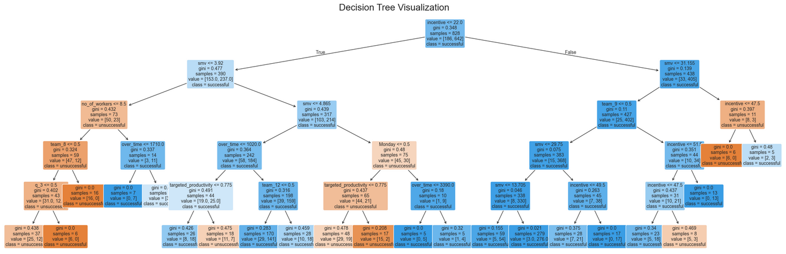

# Productivity Tree Model

In this project, our goal is to demonstrate the process of building a successful classification decision tree machine learning model. Our model will aim to predict the productivity of garment employee teams. From data cleaning and examination to model training and finally to model evaluation, we are able to build a model with an accuracy of **86%**.

We will be using a dataset created by Abdullah Al Imran, Md Shamsur Rahim, and Tanvir Ahmed in **2021**. It can be downloaded [here](https://archive.ics.uci.edu/dataset/597/productivity+prediction+of+garment+employees).

View this project live on Google Colab [here](https://colab.research.google.com/drive/1TTu97SWh1WQ-FlDcweJq4_jHlnUlYwr_?usp=sharing).
